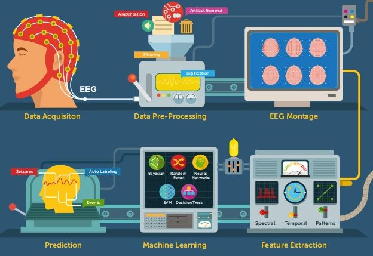

## Tutorial: Signal Processing and Machine Learning for EEG-based BCI Systems

### Overview

In this tutorial, we will review some common [signal processing](https://en.wikipedia.org/wiki/Signal_processing) and [machine learning](https://en.wikipedia.org/wiki/Machine_learning) techniques that have been used in [EEG](https://en.wikipedia.org/wiki/Electroencephalography)-based [brain-computer interface](https://en.wikipedia.org/wiki/Brain–computer_interface) (BCI) systems to translate brain signals into messages and commands.

### Disclaimer

This notebook owes much of its content to the [MNE](https://martinos.org/mne/) and [PyRiemann]([PyRiemann](https://github.com/alexandrebarachant/pyRiemann)) packages.

Most of the examples were partially inspired by the well-documented and high-quality tutorials available in the official documentations (most of which, by the way, are also available as Jupyter notebooks).

To all the developers who have contributed to these modules:

### References

#### Books

* Bear, M. F., Connors, B. W., & Paradiso, M. A. (2016). **Neuroscience: Exploring the brain** (4th edition). Wolters Kluwer. 
* Cohen, M. X. (2014). **Analyzing neural time series data: Theory and practice**. The MIT Press.
* Graimann, B., Allison, B., & Pfurtscheller, G. (Eds.). (2010). **Brain-computer interfaces: Revolutionizing human-computer interaction**. Springer.
* Géron, A. (2019). **Hands-on machine learning with Scikit-Learn, Keras, and TensorFlow: Concepts, tools, and techniques to build intelligent systems**. O'Reilly.
* Nam, C. S., Nijholt, A., & Lotte, F. (Eds.). (2018). **Brain-computer interfaces handbook: Technological and theoretical advances**. Taylor & Francis, CRC Press.
* Niedermeyer, E., Schomer, D. L., & Lopes da Silva, F. H. (Eds.). (2011). **Niedermeyer’s electroencephalography: Basic principles, clinical applications, and related fields** (6th edition). Wolters Kluwer, Lippincott Williams & Wilkins.

#### Packages

* [MNE](https://mne.tools/stable/index.html) - *Open-source Python software for exploring, visualizing, and analyzing human neurophysiological data: MEG, EEG, sEEG, ECoG, and more*
* [SciKit-Learn](https://scikit-learn.org/stable/index.html) - *Machine Learning in Python*
* [Numpy](https://numpy.org) - *Fundamental package for scientific computing with Python*
* [PyRiemann](https://github.com/alexandrebarachant/pyRiemann) - *a python package for covariance matrices manipulation and classification through riemannian geometry*

#### Sites

* [BNCI Horizon 2020](http://bnci-horizon-2020.eu) - *The Future of Brain/Neural Computer Interaction: Horizon 2020*
* [EDFbrowser](https://www.teuniz.net/edfbrowser/) - *Free, opensource, multiplatform, universal viewer and toolbox intended for, but not limited to, timeseries storage files like EEG, EMG, ECG, BioImpedance, etc.*

#### Blogs

* [Alexandre Barachant's personal blog](http://alexandre.barachant.org/blog/)
* [Brain-Computer Interfaces over EEG](https://bciovereeg.blogspot.com)